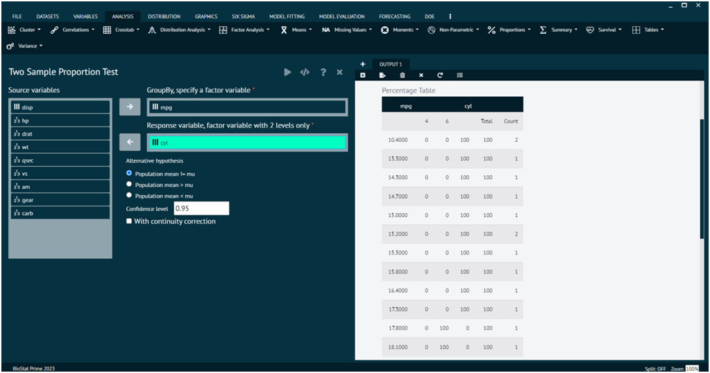

# Proportions

### Two Sample Proportion Test

A two-sample proportion test is a statistical method used to compare the proportions of two independent groups. This test is often applied when you have two sets of binary data, and you want to determine if there is a significant difference between the proportions of success (or presence of an attribute) in the two groups.

>prop.test can be used for testing the null that the proportions (probabilities of success) in several groups are the same, or that they equal certain given values.

To analyse it in BioStat Prime user must follow the steps as given.

Steps
: __Load the dataset -> Click on the analysis tab in main menu -> Select proportions -> The proportions tab leads to Two Sample Proportion Test -> In the dialog select the variable and options according to the requirement -> Execute the dialog.__

{ width="700" }{ border-effect="rounded" }

>Arguments

x
: a vector of counts of successes, a one-dimensional table with two entries, or a two-dimensional table (or matrix) with 2 columns, giving the counts of successes and failures, respectively.

n
: a vector of counts of trials; ignored if x is a matrix or a table.

p
: a vector of probabilities of success. The length of p must be the same as the number of groups specified by x, and its elements must be greater than 0 and less than 1.

alternative
: a character string specifying the alternative hypothesis, must be one of "two.sided" (default), "greater" or "less". User can specify just the initial letter. Only used for testing the null that a single proportion equals a given value, or that two proportions are equal; ignored otherwise.

conf.level
: confidence level of the returned confidence interval. Must be a single number between 0 and 1. Only used when testing the null that a single proportion equals a given value, or that two proportions are equal; ignored otherwise.

correct
: a logical indicating whether Yates' continuity correction should be applied where possible.

### Single Sample Exact Binomial Test

The single sample exact binomial test is a statistical test used to assess whether the observed proportion of successes in a binary outcome significantly differs from a hypothesized proportion. It is appropriate when you have a single group or sample with binary data, and you want to test if the observed proportion is consistent with a specific value.

>Performs an exact test of a simple null hypothesis about the probability of success in a Bernoulli experiment.

To analyse it in BioStat Prime user must follow the steps as given.

Steps
: __Load the dataset -> Click on the analysis tab in main menu -> Select proportions -> The proportions tab leads to Single Sample Exact Binomial Test -> In the dialog select the variable and options according to the requirement -> Execute the dialog.__

{ width="700" }{ border-effect="rounded" }

>Arguments

x
: number of successes, or a vector of length 2 giving the numbers of successes and failures, respectively.

n
: number of trials; ignored if x has length 2.

p
: hypothesized probability of success.

alternative
: indicates the alternative hypothesis and must be one of "two.sided", "greater" or "less". You can specify just the initial letter.

conf.level
: confidence level for the returned confidence interval.

### Single Sample Proportion Test

The single sample proportion test is a statistical test used to determine whether the observed proportion of successes in a binary outcome significantly differs from a hypothesized proportion. This test is particularly useful when you have a single group or sample with binary data, and you want to evaluate whether the sample proportion is consistent with a specified value.

>prop.test can be used for testing the null that the proportions (probabilities of success) in several groups are the same, or that they equal certain given values.

To analyse it in BioStat Prime user must follow the steps as given.

Steps
: __Load the dataset -> Click on the analysis tab in main menu -> Select proportions -> The proportions tab leads to Single Sample Proportion Test -> In the dialog select the variable and options according to the requirement -> Execute the dialog.__

{ width="700" }{ border-effect="rounded" }

>Arguments

x
: a vector of counts of successes, a one-dimensional table with two entries, or a two-dimensional table (or matrix) with 2 columns, giving the counts of successes and failures, respectively.

n
: a vector of counts of trials; ignored if x is a matrix or a table.

p
: a vector of probabilities of success. The length of p must be the same as the number of groups specified by x, and its elements must be greater than 0 and less than 1.

alternative
: a character string specifying the alternative hypothesis, must be one of "two.sided" (default), "greater" or "less". User can specify just the initial letter. Only used for testing the null that a single proportion equals a given value, or that two proportions are equal; ignored otherwise.

conf.level
: confidence level of the returned confidence interval. Must be a single number between 0 and 1. Only used when testing the null that a single proportion equals a given value, or that two proportions are equal; ignored otherwise.

correct
: a logical indicating whether Yates' continuity correction should be applied where possible.

