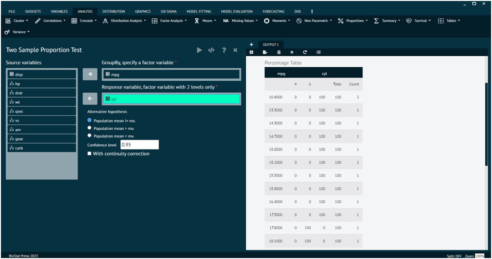
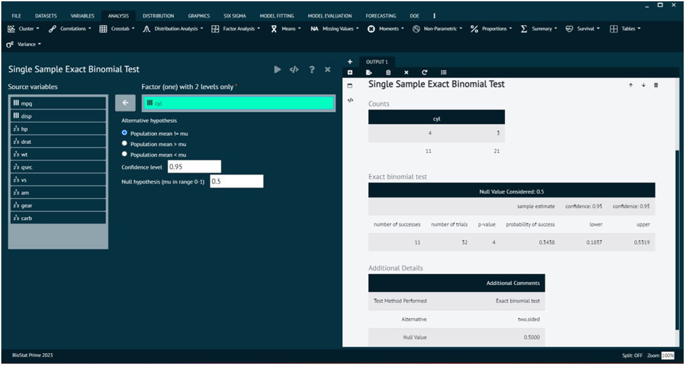
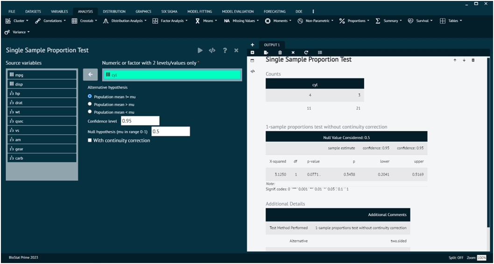
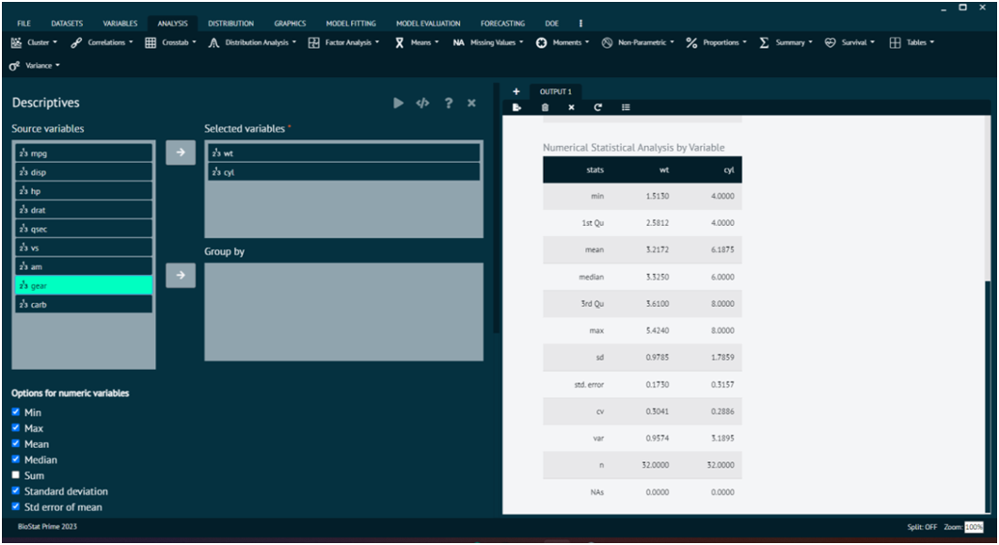
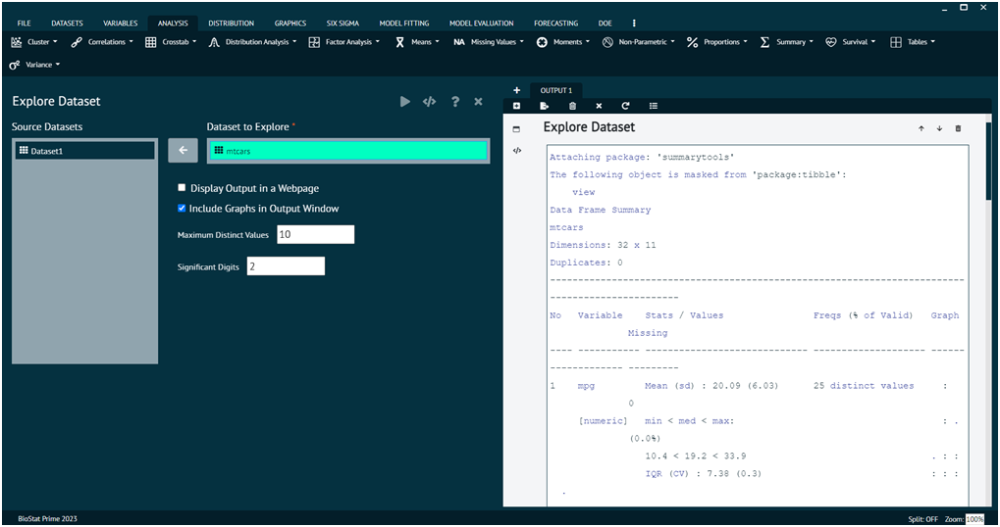
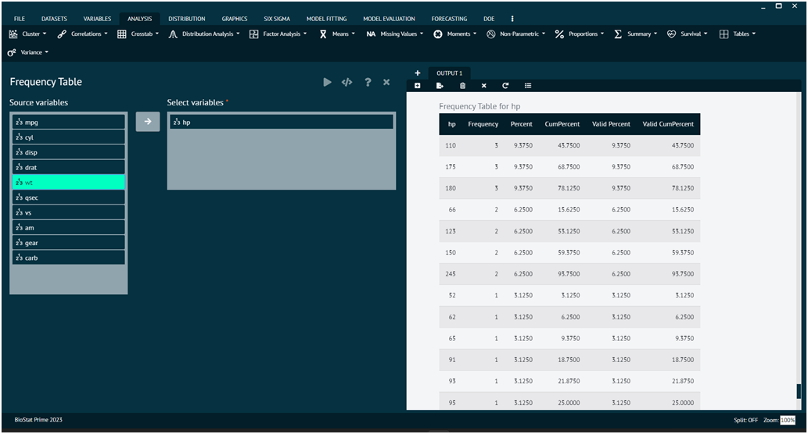

# Proportions

### Two Sample Proportion Test

A two-sample proportion test is a statistical method used to compare the proportions of two independent groups. This test is often applied when you have two sets of binary data, and you want to determine if there is a significant difference between the proportions of success (or presence of an attribute) in the two groups.

To analyse it in BioStat Prime user must follow the steps as given.

__Load the dataset -> Click on the analysis tab in main menu -> Select proportions -> The proportions tab leads to Two Sample Proportion Test -> In the dialog select the variable and options according to the requirement -> Execute the dialog.__

{ width="700" }{ border-effect="rounded" }

### Single Sample Exact Binomial Test

The single sample exact binomial test is a statistical test used to assess whether the observed proportion of successes in a binary outcome significantly differs from a hypothesized proportion. It is appropriate when you have a single group or sample with binary data, and you want to test if the observed proportion is consistent with a specific value.

To analyse it in BioStat Prime user must follow the steps as given.

__Load the dataset -> Click on the analysis tab in main menu -> Select proportions -> The proportions tab leads to Single Sample Exact Binomial Test In the dialog select the variable and options according to the requirement -> Execute the dialog.__

{ width="700" }{ border-effect="rounded" }

### Single Sample Proportion Test

The single sample proportion test is a statistical test used to determine whether the observed proportion of successes in a binary outcome significantly differs from a hypothesized proportion. This test is particularly useful when you have a single group or sample with binary data, and you want to evaluate whether the sample proportion is consistent with a specified value.

To analyse it in BioStat Prime user must follow the steps as given.

__Load the dataset -> Click on the analysis tab in main menu -> Select proportions -> The proportions tab leads to Single Sample Proportion Test -> In the dialog select the variable and options according to the requirement -> Execute the dialog.__

{ width="700" }{ border-effect="rounded" }

## Summary/Descriptive Statistics

Descriptive statistics are used to summarize and describe a dataset, providing a clear and concise overview of its main characteristics. There are several types of descriptive statistics commonly used, includingMeasures of central tendency are statistical measures that describe the centre or typical value of a dataset. They provide insight into where the "average" or "middle" of the data lies.

To analyse it in BioStat Prime user must follow the steps as given.

__Load the dataset -> Click on the analysis tab in main menu -> Select summary.__

The summary tab contains an option namely descriptive that contains all the descriptive statistic analysis techniques. Once the descriptive techniques are chosen and variables are targeted then, user needs to execute the dialog to see the analysis in output window.

{ width="700" }{ border-effect="rounded" }

In Descriptive function of summary tab, user can opt for options like MIN, MAX, MEAN, MEDIAN, SUM, STANDARD DEVIATION, STD ERROR MEAN as per the requirement.
Furthermore, other functions can also be applied on the dataset like explore dataset, explore variables, frequencies.

### Explore Dataset

This section of summary tab gives user a chance to explore the dataset. The picture below shows the way user can opt for required dataset and explore it.

{ width="700" }{ border-effect="rounded" }

### Explore Variables

This section of summary tab gives user a chance to explore the variables of loaded dataset. The picture below shows the way user can choose required variables and execute the dialog to explore it.

{ width="700" }{ border-effect="rounded" }

### Frequency

This section of summary tab gives user a chance to evaluate the frequencies of different variables of loaded dataset. The picture below shows the way user can choose required variables and execute the dialog to evaluate the frequency of selected variable.

{ width="700" }{ border-effect="rounded" }
