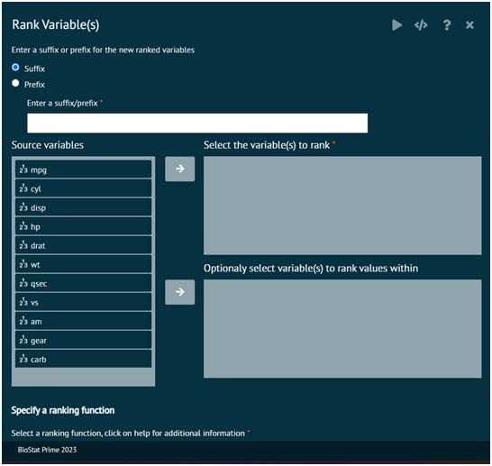

# Rank Variable(s)
RANKS WILL BE STORED IN NEW VARIABLES WITH THE PREFIX OR SUFFIX SPECIFIED

Six variations on ranking functions, mimicking the ranking functions described in SQL2003. They are currently implemented using the built in rank function, and are provided mainly as a convenience when converting between R and SQL. 

All ranking functions map smallest inputs to smallest outputs. 

>Use desc() to reverse the direction.
>
{style="note"}

{ width="700" }{ border-effect="rounded" }

>Arguments
>1. x: A vector of values to rank. Missing values are left as is. If you want to treat them as the smallest or largest values, replace with Inf or -Inf before ranking.
>2. n: number of groups to split up into.

>Details

__row_number()__
: equivalent to rank(ties.method = "first")

__min_rank()__
: equivalent to rank(ties.method = "min")

__dense_rank()__
: like min_rank(), but with no gaps between ranks

__percent_rank()__
: a number between 0 and 1 computed by rescaling min_rank to [0, 1]

__cume_dist()__
: a cumulative distribution function. Proportion of all values less than or equal to the current rank.

__ntile()__
: a rough rank, which breaks the input vector into n buckets.