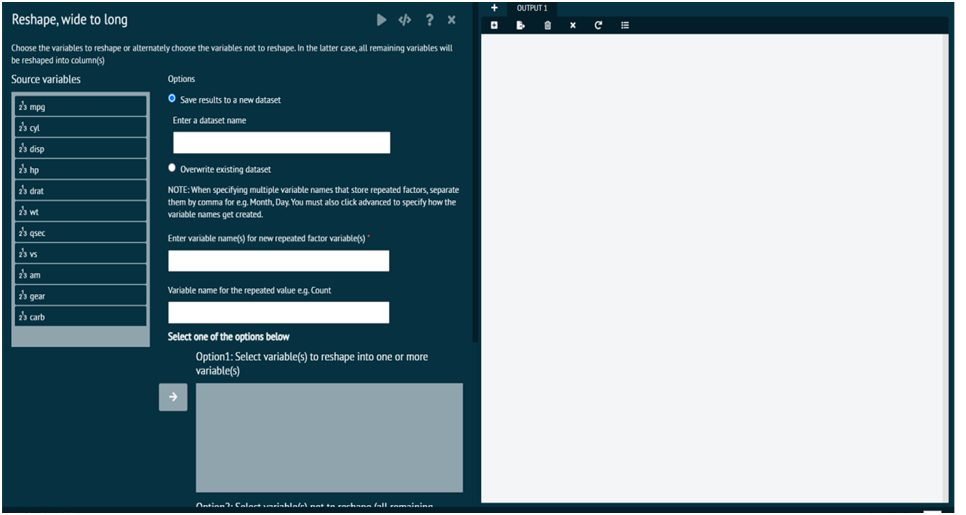
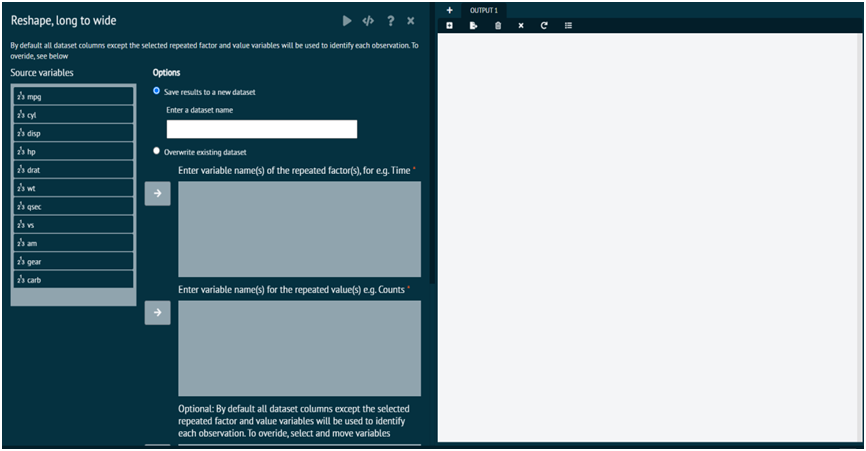

# ReShape

This section of the dataset tab aids the user to Reshape the loaded datasets. This tab has 2 options, viz.

### Reshape wide to long

Reshape wide to long option takes a wide dataset and converts it to a long dataset by converting columns into key value pairs, Pivot_longer takes multiple columns and collapses into key-value pairs, duplicating all other columns as needed. User can use pivot_longer() when user notices that he has columns that are not variables.

User can choose the variables to reshape or alternately choose the variables not to reshape from wide dataset to long dataset. In the latter case, all remaining variables will be reshaped into column(s). 

>When specifying multiple variables for the repeated factor(s) separate them by ,
>
{style="note"}

{ width="700" }{ border-effect="rounded" }

>R package Required: tidyr
>
{style="note"}

### Reshape Long to Wide

User here chooses to reshape from longer dataset to wider dataset. This option takes a wide dataset and converts it to a long dataset by converting (widening) columns. Pivot_wider "lengthens" data, increasing the number of rows and decreasing the number of columns. User can use pivot_wider when user has variables/columns whose values need to be in rows.

>NOTE:
> When one repeated factor is specified, new variable names are prefixed with the name of the repeated factor. When multiple repeated factors are specified, they are prefixed by the name of the value variable
> 
{style="note"}

> By default, all dataset columns except the selected repeated factor and value variables will be used to identify each observation.
>
{style="note"}

{ width="700" }{ border-effect="rounded" }
