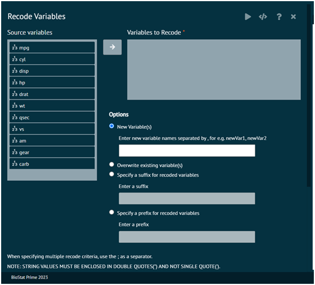

# Recode Variables
Recodes one or more a numeric vector, character vector, or factors according to recode specifications. User can store the results by overwriting existing variables, specifying new variable names to store recoded values or choosing to store the recoded values in new variables with a suitable prefix or suffix. the prefix or suffix will be applied to the existing variable name.

{ width="700" }{ border-effect="rounded" }

>Arguments

__colNames__
: A character vector containing one or more variables in the dataset to recode

__newColNames__
: A character vector containing the names of the new columns.

__OldNewVals__
: A character string of recode specifications in the form oldval1,newval1, oldval2,newval2

__NewCol__
: A Boolean indicating whether recoded values are stored in new variables (TRUE) or existing variables are overwritten(FALSE).

__prefixOrSuffix__
: Specify if user wants to store the recoded values in new variables prefixed or suffixed with the name user specifies. Enter prefix or suffix.

__prefixOrSuffixString__
: Enter a string to use as a prefix or suffix to the existing variable name. Recoded values will be stored in these variables.

__dataSetNameOrIndex__
: The dataset/dataframe name

>Note: BioStat Prime will not convert from numeric to factor. When a numeric is recoded, it will remain a numeric, when a factor variable is recoded it will remain a factor.
> 
{style="note"}