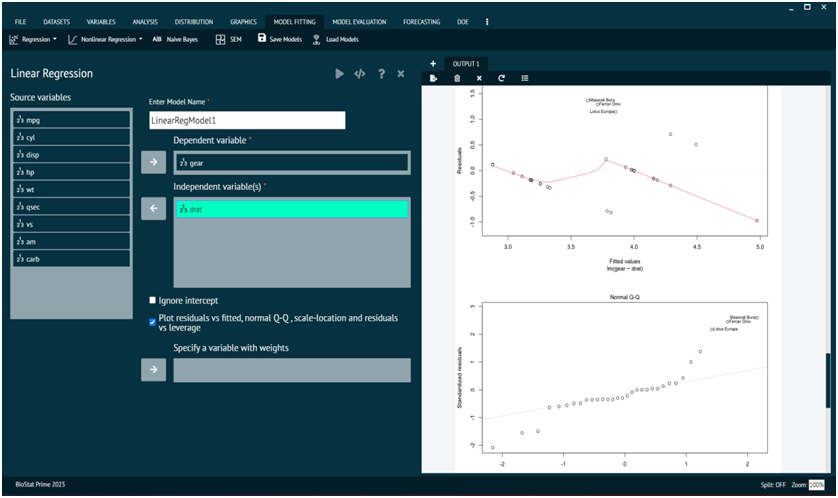
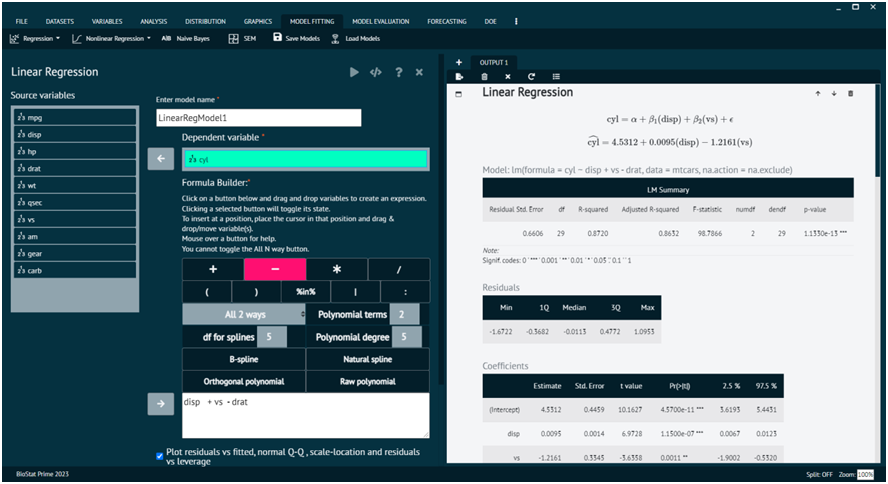

# Regression
Regression analysis is a statistical method used to examine the relationship between one dependent variable and one or more independent variables. The primary goal of regression analysis is to understand how the independent variables contribute to the variation in the dependent variable. It is widely used in various fields, including economics, finance, biology, and social sciences.

To analyse it in BioStat Prime user must follow the steps as given.

Steps
: __Load the dataset -> Click on the Model Fitting tab in main menu -> Select Linear regression -> This leads to analysis techniques dropdown -> The various options in the dialog can be selected to opt for plot etc -> Finally execute the plot and visualise the output in output window.__

{ width="700" }{ border-effect="rounded" }

BioStat also provides advanced regression analysis functions that can create models based on interactive terms via formula builder.

{ width="700" }{ border-effect="rounded" }

>Note that the variables so selected are substituted as quotients in the formula built by the user.
>
{style="note"}
