# Regression
Regression analysis is a statistical method used to examine the relationship between one dependent variable and one or more independent variables. The primary goal of regression analysis is to understand how the independent variables contribute to the variation in the dependent variable. It is widely used in various fields, including economics, finance, biology, and social sciences.

To analyse it in BioStat Prime user must follow the steps as given.

__Load the dataset -> Click on the Model Fitting tab in main menu -> Select Linear regression or Non-linear regression based on the requirement -> This leads to analysis techniques in the dialog -> The various options in the dialog can be selected to opt for plot etc -> Finally execute the plot and visualise the output in output window.__

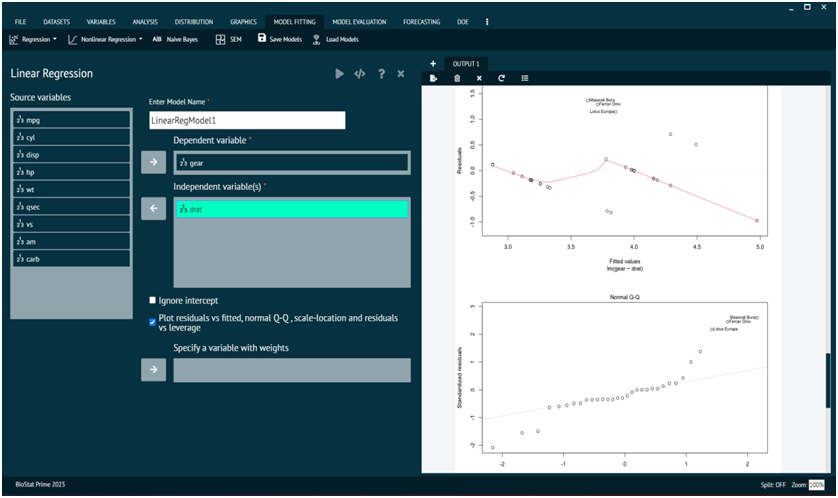{ width="700" }{ border-effect="rounded" }

BioStat also provides advanced regression analysis functions that can create models based on interactive terms via formula builder.

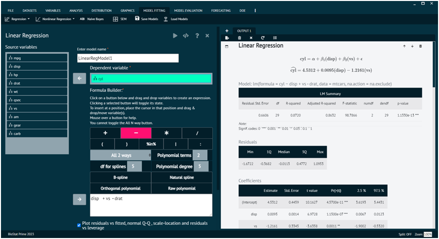{ width="700" }{ border-effect="rounded" }

Note that the variables so selected are substituted as quotients in the formula built by the user.

### Cox, Advanced

To analyse it in BioStat Prime user must follow the steps as given.

__Load the dataset -> click on the Model Fitting tab in main menu -> Select Regression -> This leads to analysis techniques, choose Cox Basics -> There will appear a dialog, Select the source variables to enter in Time to event or censor and Events (1 = event 1, 0 = censor) options in the dialog -> Populate a formula -> Finally execute.__

Using Formula Builder: A Guide

1.	To create an expression, click one of the buttons below and drag & drop variables.
2.	Toggle the selected button's state by clicking it.
3.	Place the cursor where user wants to insert the variable(s) and drag and drop or move it there.
4.	Touch a button to see assistance.
5.	The All N way button is not able to be toggled.

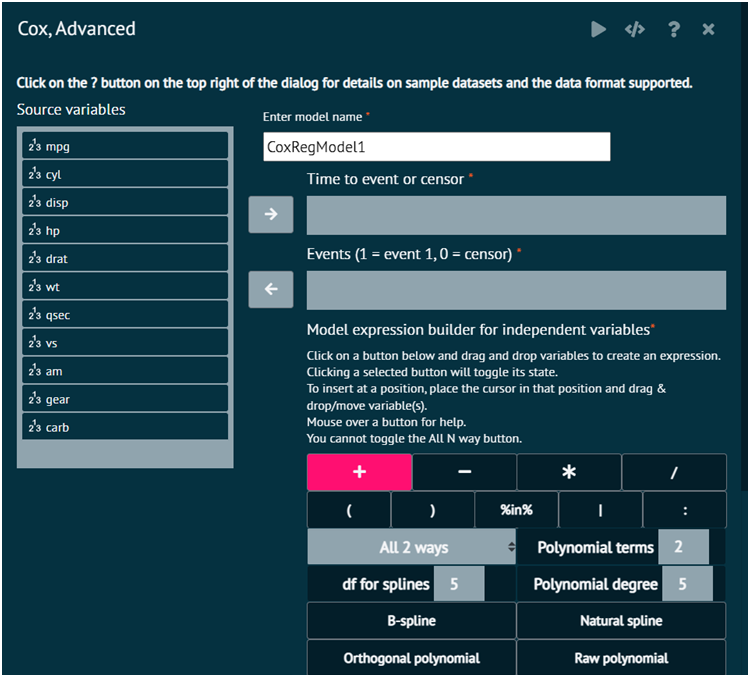{ width="700" }{ border-effect="rounded" }

### Cox, Basics

To analyse it in BioStat Prime user must follow the steps as given.

__After loading the dataset, select Regression from the Model Fitting tab in the main menu -> This will lead to analytic approaches; select Cox Basics -> A dialog box will then display. In the dialog, select the source variables that need to be established as independent variables -> Lastly, choose which source variables to insert in the Time to event or censor, Events (1 = event 1, 0 = censor) options. -> Finally execute.__

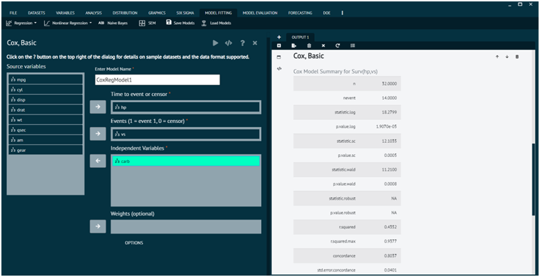{ width="700" }{ border-effect="rounded" }

### Cox, Binary Time-depended covariates

To analyse it in BioStat Prime user must follow the steps as given.

__Load the dataset -> Click on the Model Fitting tab in main menu -> Select Regression -> This leads to analysis techniques, choose Cox, Binary Time-depended covariates -> There will appear a dialog -> Select the variables in the dialog and populate a formula -> Finally execute the plot and visualise the output in output window.__

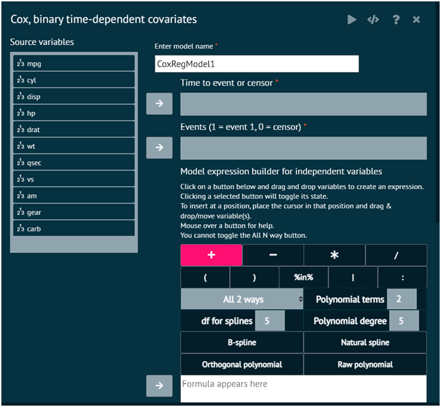{ width="700" }{ border-effect="rounded" }

### Cox, Fine-Gray

To analyse it in BioStat Prime user must follow the steps as given.

__Load the dataset -> Click on the Model Fitting tab in main menu -> Select Regression -> This leads to analysis techniques, choose Cox, Fine-Gray -> There will appear a dialog -> Select the variables in the dialog and populate a formula -> Finally execute the plot and visualise the output in output window.__

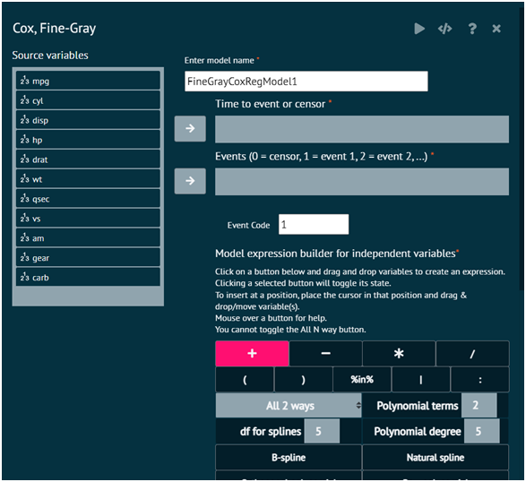{ width="700" }{ border-effect="rounded" }

### Cox Regression, Multiple models

{ width="700" }{ border-effect="rounded" }

### Cox, Stratified

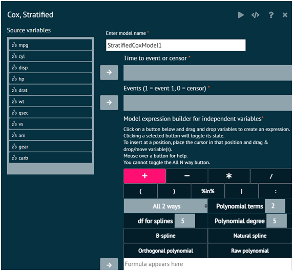{ width="700" }{ border-effect="rounded" }

### Linear Regression, Advanced

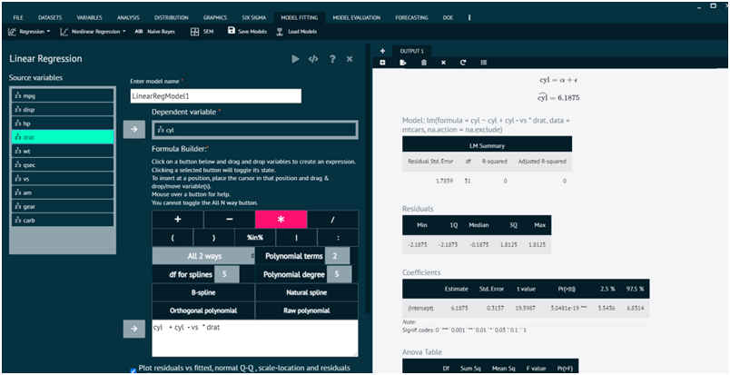{ width="700" }{ border-effect="rounded" }

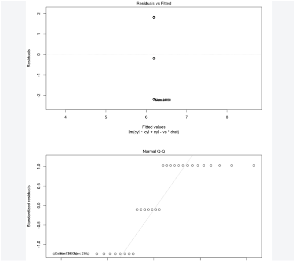{ width="700" }{ border-effect="rounded" }

### Linear Regression, Basics

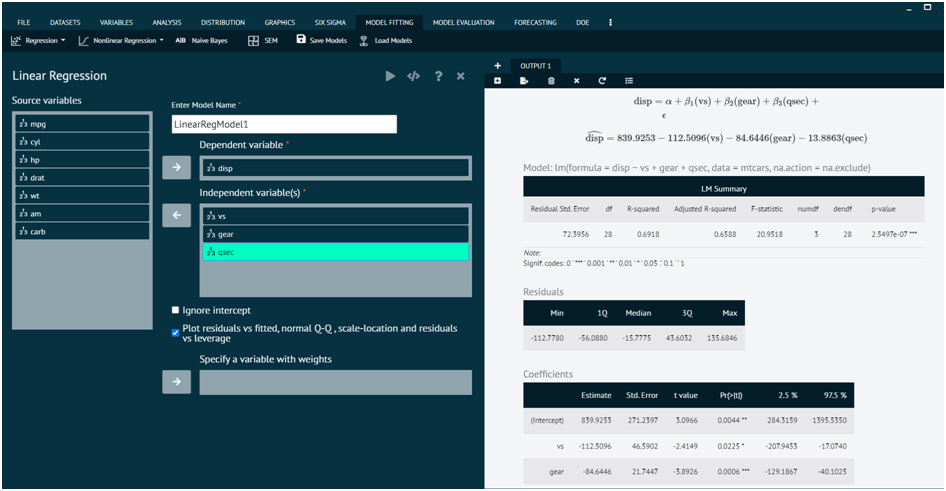{ width="700" }{ border-effect="rounded" }

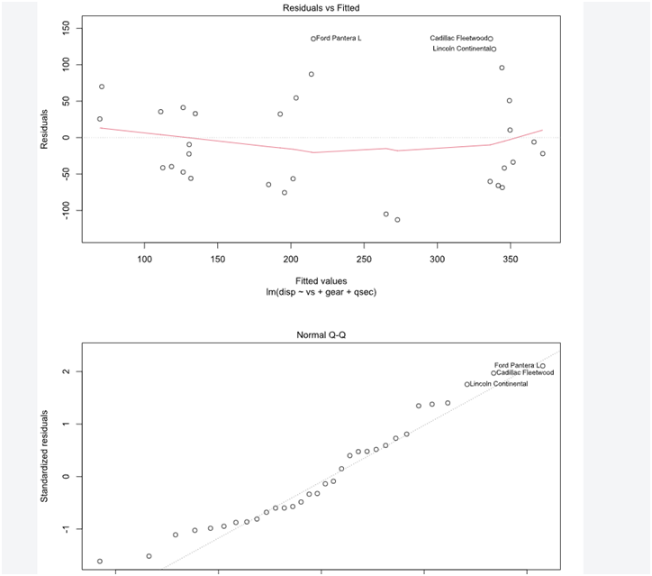{ width="700" }{ border-effect="rounded" }

### Linear Regression (Legacy)

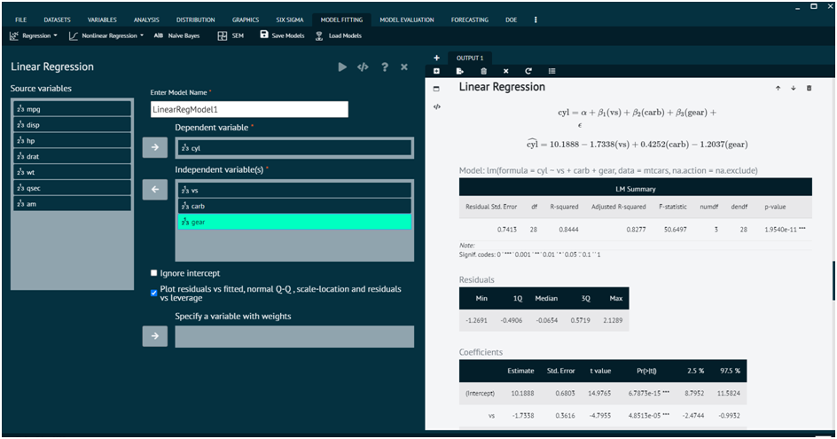{ width="700" }{ border-effect="rounded" }

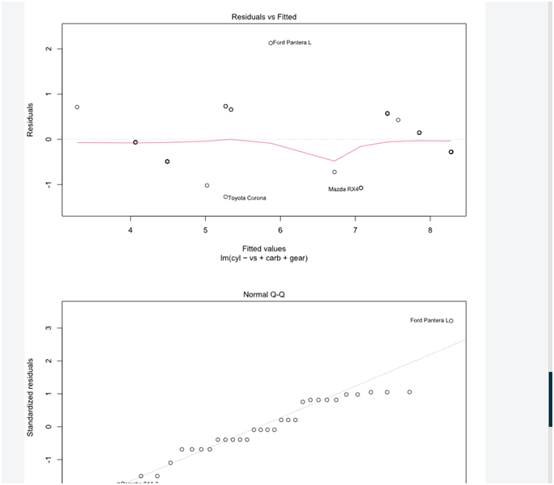{ width="700" }{ border-effect="rounded" }

### Linear Regression, multiple models

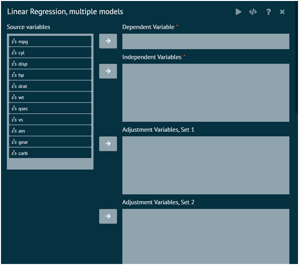{ width="700" }{ border-effect="rounded" }

### Logistic Regression, Advanced

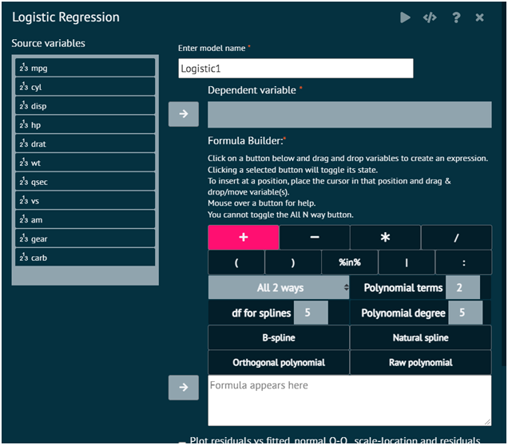{ width="700" }{ border-effect="rounded" }

### Logistic Regression, Basic

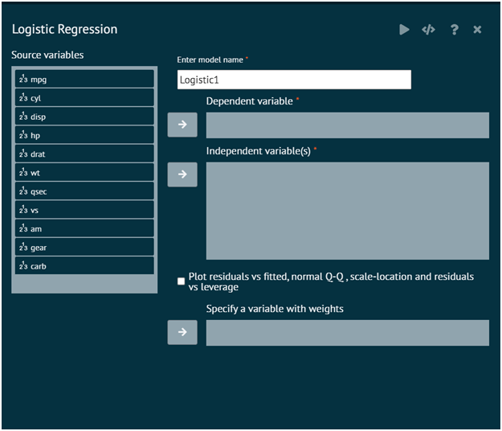{ width="700" }{ border-effect="rounded" }

### Logistic Regression, Conditional

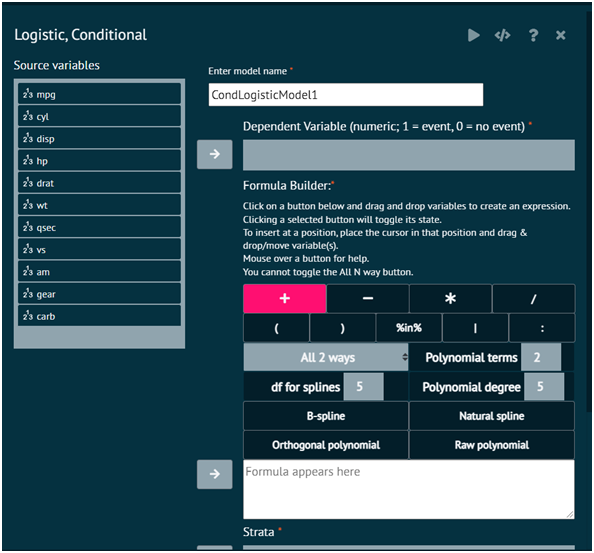{ width="700" }{ border-effect="rounded" }

### Logistic Regression, multiple models

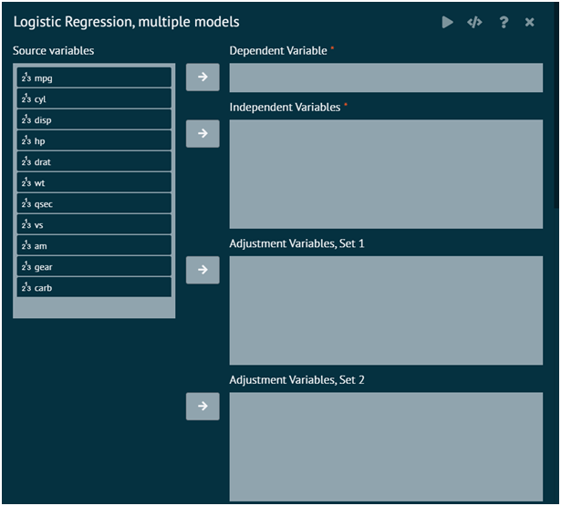{ width="700" }{ border-effect="rounded" }

### Multinomial Logit

{ width="700" }{ border-effect="rounded" }

### Ordinal Regression

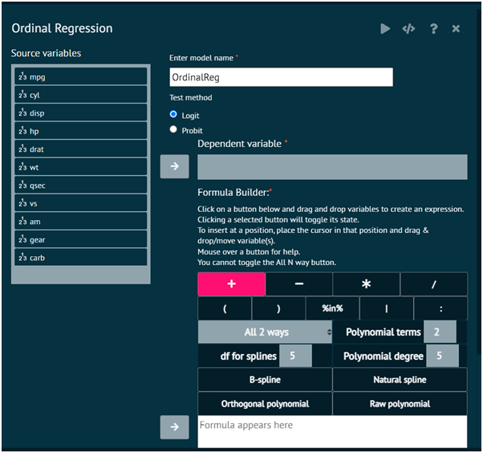{ width="700" }{ border-effect="rounded" }

### Quantile Regression

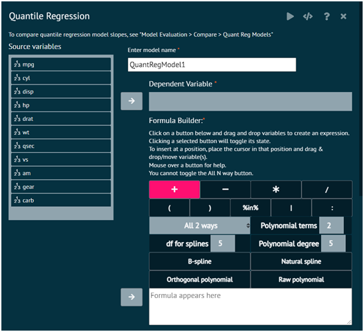{ width="700" }{ border-effect="rounded" }
