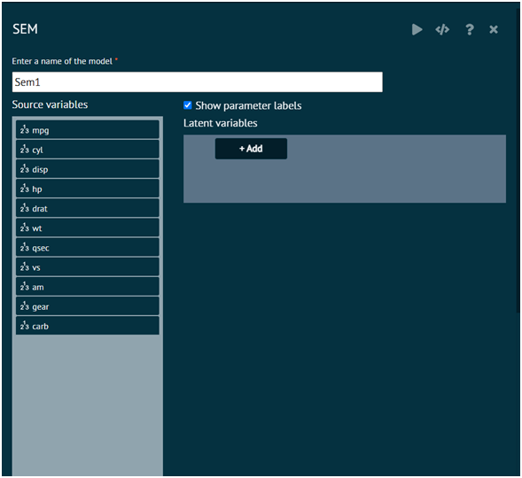

# SEM

This function Fits a Structural Equation Model (SEM).

To analyse it in BioStat Prime user must follow the steps as given.

Steps
: __Load the dataset -> Click on the Model Fitting tab in main menu -> Select SEM -> There will appear a dialog -> Select the Model name, Latent variables in the dialog -> Fill in the other options. -> Finally execute the plot and visualise the output in output window.__

{ width="700" }{ border-effect="rounded" }
