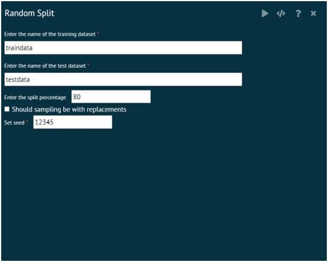
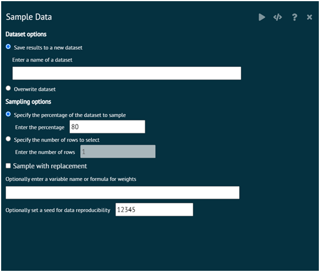
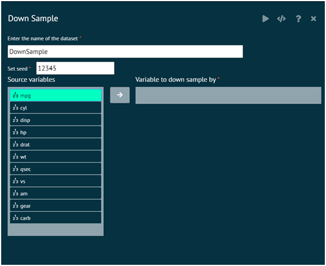
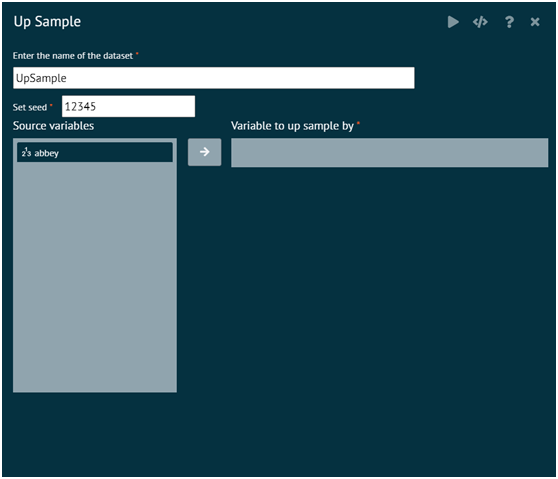
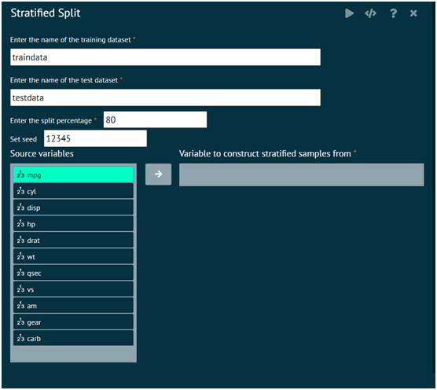

# Sampling

Sample takes a sample of the specified size from the elements of x using either with or without replacement.

### Random Split
If x has length 1, is numeric (in the sense of is.numeric) and x >= 1, sampling via sample takes place from 1:x.

{ width="700" }{ border-effect="rounded" }

>x: Either a vector of one or more elements from which to choose, or a positive integer.
> 
{style="note"}

### Sample Data
Sample Data takes a random sample of the rows from the existing dataset. Samples a % of rows or a specified number of rows with or without replacement. Saves the result to a new dataset or overwrites the existing dataset.

{ width="700" }{ border-effect="rounded" }

### Down Sample
Down-Sampling Imbalanced Data. DownSample will randomly sample a data set so that all classes have the same frequency as the minority class.

{ width="700" }{ border-effect="rounded" }

### Up Sample
Up-Sampling Imbalanced Data. upSample samples with replacement to make the class distributions equal.

{ width="700" }{ border-effect="rounded" }

### Stratified Split
A series of test/training partitions are created using createDataPartition while createResample creates one or more bootstrap samples. createFolds splits the data into k groups while createTimeSlices creates cross-validation split for series data. groupKFold splits the data based on a grouping factor.

{ width="700" }{ border-effect="rounded" }
