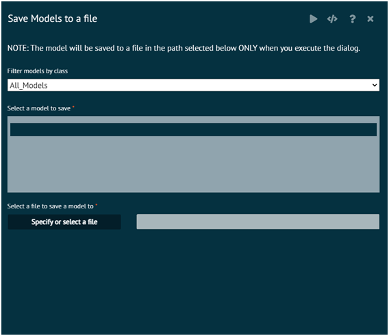

# Save Model to a file

Models selected will be saved to a file in the R data format (.RData extension)

User can specify a new file by entering a name or selecting an existing file.

If user selects an existing file, it will be overwritten.

User has to click the execute button (the horizontal triangle button) to run the dialog and save the objects to a file.

{ width="700" }{ border-effect="rounded" }

## Arguments

model1, model2...
: fitted model objects

file
:file name with path, the model objects selected will be saved to this RData file

>For detailed help click on the R icon on the top right hand side of the help dialog overlay
> 
{style="note"}
