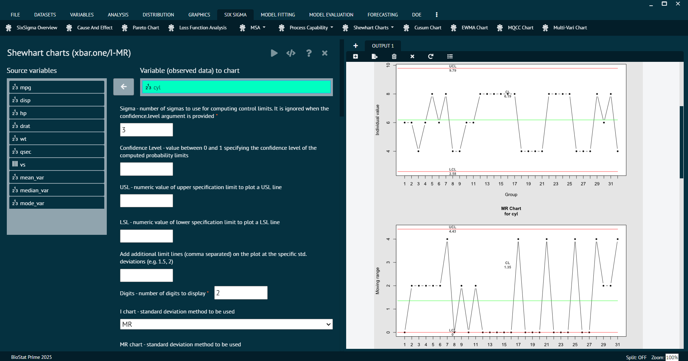

# Shewhart Charts

These charts are widely used in quality control and statistical process monitoring to identify and address variations in a process. 

The primary goal of Shewhart Charts is to distinguish between normal process variation and variations that may indicate a need for corrective action. 

>Shewhart Charts are fundamental in quality management and Six Sigma methodologies, providing a visual and statistical approach to process control. 
> 
{style="note"}

There are several types of Shewhart Charts, each designed to monitor different aspects of a process.

### Shewhart Chart (Xbar,R,S)

To analyse in Shewhart Chart (Xbar,R,S) BioStat user must follow the steps given below.

Steps
: __Load the dataset -> Click on the Six Sigma tab in main menu -> Select Shewhart Charts -> Choose Shewhart Chart (Xbar,R,S) -> This leads to analysis techniques in the dialog -> Selected the various options in the dialog according to the requirement -> Execute and visualise the output in output window.__

{ width="700" }{ border-effect="rounded" }

### Shewhart Chart (P,NP,C,U)

Used for monitoring the proportion of nonconforming items in a sample (p-chart), the number of nonconforming items in a sample (np-chart), the count of nonconforming items in a subgroup (c-chart), and the number of nonconforming units per unit (u-chart).

To analyse in Shewhart Chart (P, NP, C, U) BioStat user must follow the steps given below.

Steps
: __Load the dataset -> Click on the Six Sigma tab in main menu -> Select Shewhart Charts -> Choose Shewhart Chart (P, NP, C, U) -> This leads to analysis techniques in the dialog -> Selected the various options in the dialog according to the requirement -> Execute and visualise the output in output window.__

{ width="700" }{ border-effect="rounded" }

### Shewhart Chart (Xbar.One/I-MR)

The X-bar and Individual Moving Range (X-bar.I-MR or X-bar.One) chart is a specific type of Shewhart control chart commonly used for monitoring the central tendency (average) and dispersion of a process over time. This type of chart is suitable when the data is collected in subgroups, and each subgroup consists of a small number of individual measurements.

To analyse in Shewhart Chart (Xbar.One/I-MR) BioStat user must follow the steps given below.

Steps
: __Load the dataset -> Click on the Six Sigma tab in main menu -> Select Shewhart Charts -> Choose Shewhart Chart (Xbar.One/I-MR) -> This leads to analysis techniques in the dialog -> Selected the various options in the dialog according to the requirement -> Execute and visualise the output in output window.__

{ width="700" }{ border-effect="rounded" }

### Shewhart Chart (I-MR Between/Within)

The Individual and Moving Range (I-MR) Between/Within control chart is a specific type of Shewhart control chart used when the data collected is organized into subgroups, and each subgroup consists of measurements taken at different levels (or locations) and at different times. This type of chart is commonly used when assessing the variation between different levels and within each level of a process.

To analyse in Shewhart Chart (I-MR Between/Within) BioStat user must follow the steps given below.

Steps
: __Load the dataset -> Click on the Six Sigma tab in main menu -> Select Shewhart Charts -> Choose Shewhart Chart (I-MR Between/Within) -> This leads to analysis techniques in the dialog -> Selected the various options in the dialog according to the requirement -> Execute and visualise the output in output window.__

{ width="700" }{ border-effect="rounded" }
