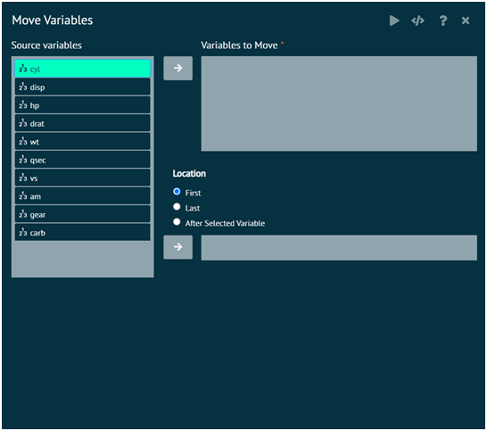
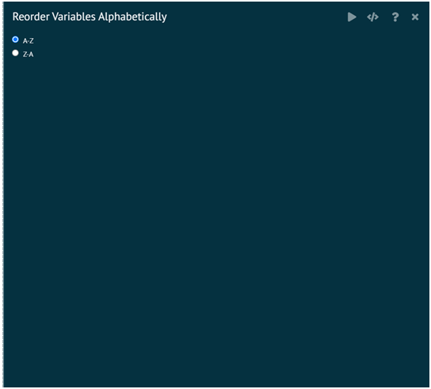
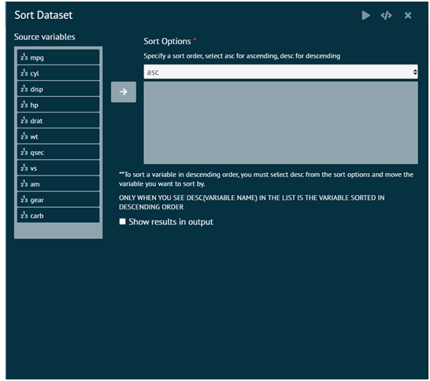

# Sort

### Move Variables
This will move variables to a specified location in the data set.

__Variables to Move__: Variables to move to a different location. They will be placed in the order specified in this box.

__Location__: Location in the data set to move the variables. First places the variables at the beginning of the data set. Last places the variables at the end of the data set. After Selected Variable places the variables after this variable in the data set.

>Required R Packages: dplyr
>
{style="note"}

{ width="700" }{ border-effect="rounded" }

### Reorder Variables
Re-order variables in the dataset in alphabetical order. User uses the sort function to sort the names of the columns/variables in the dataset and the select function in the package dplyr to select the column names in the correct alphabetical order.

{ width="700" }{ border-effect="rounded" }

### Sort Dataset
To sort a variable in descending order, user must select desc from the sort options and move the variable user wants to sort by.

{ width="700" }{ border-effect="rounded" }
