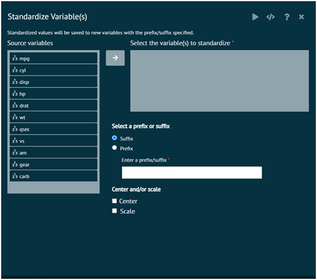

# Standardize Variable(s)
Standardizes variables (z scores). The standardized values are stored in new variables with either the prefix or suffix of the original variables. The option is provide to center and/or scale.

{ width="700" }{ border-effect="rounded" }

>Arguments

__vars__
: One or more variables to standardize. Only numeric variables (not factors) supported.

__center__
: If center is TRUE then centering is done by subtracting the column means (omitting NAs) of x from their corresponding columns, and if center is FALSE, no centering is done.

__scale__
: If scale is TRUE then scaling is done by dividing the (centered) columns of x by their standard deviations if center is TRUE, and the root mean square otherwise. If scale is FALSE, no scaling is done.

__stingToPrefixOrSuffix__
: A character string that specifies the prefixor suffix to use for the new standardized variables( i.e. new columns in the dataset).

__prefixOrSuffix__
: specify if user wants a prefix or a suffix

__datasetname__
: The dataset/dataframe name

>Note: BioStat Prime will not convert from numeric to factor. When a numeric is recoded, it will remain a numeric, when a factor variable is recoded it will remain a factor.
> 
{style="note"}