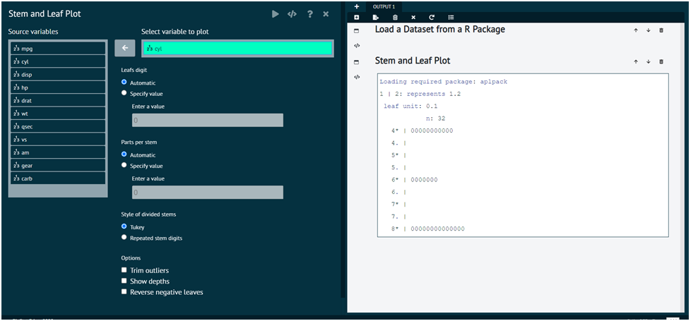

# Stem And Leaf

For representing any dataset in terms of Stem and Leaf.

Steps
: __Load the dataset that needs to be visualized -> Go to GraphicsStem and Leaf -> Put in the values for variables -> Execute the dialog.__

The output of the Stem and Leaf of a sample dataset can be seen in the picture below. 

{ width="700" }{ border-effect="rounded" }

>User can also Trim the outlines, show depths, Reverse negative leaves.
>
{style="note"}