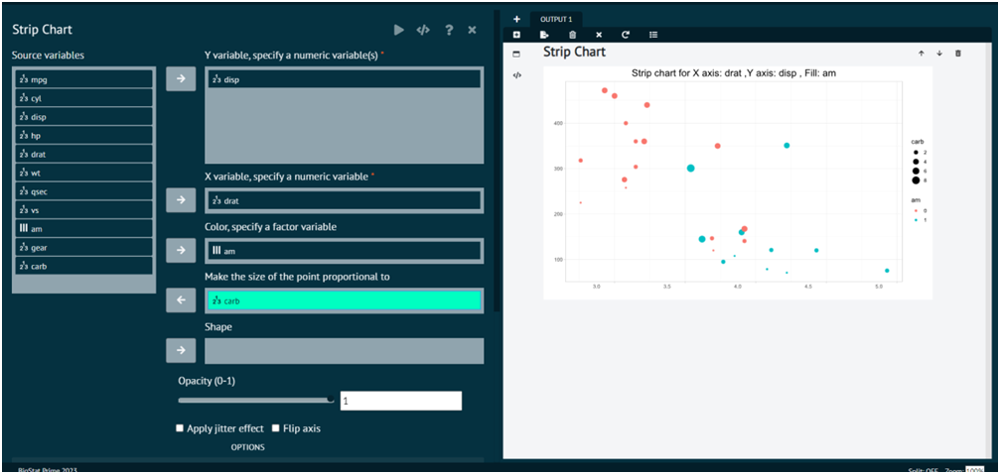

# Strip Chart

For representing any dataset in terms of Scatter Plot.

Steps
: __Load the dataset that needs to be visualized -> Go to Graphics -> Strip Chart -> Put in the values for variables -> Execute the dialog.__

The output of the Scatter Plot of a sample dataset can be seen in the picture below. 

{ width="700" }{ border-effect="rounded" }

>User can also flip axis, apply jitter effect, control the opacity of the plot in the output.
> 
{style="note"}