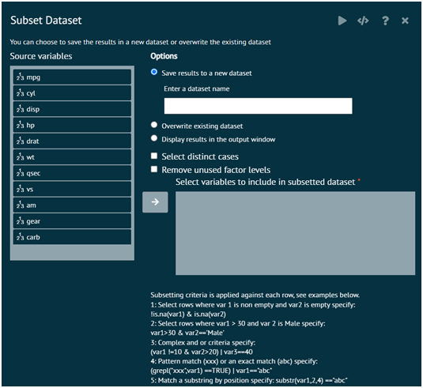
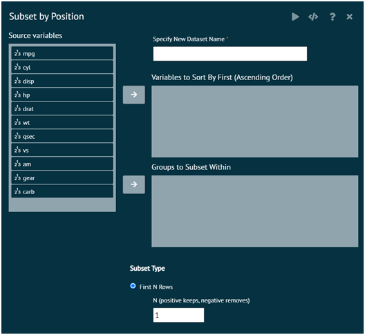
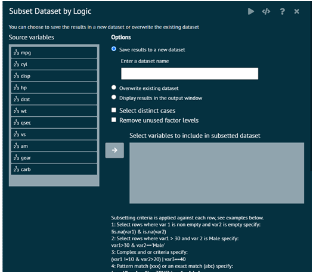

# Subset

### Subset {id="subset_1"}
Subset datasets/dataframe. Returns a subset of the dataframe/dataset. User can specify the columns/variables that user wants in the smaller dataset. User can also specify selection criteria to be applied against each row of the dataframe.

{ width="700" }{ border-effect="rounded" }

### Subset by Position
This section of Subset tab, subsets a dataset according to row position.

__Specify New Dataset Name__: Dataset name where the subsetted data will be stored

__Variables to Sort By First__: Variables used to sort the rows before any subsetting is undertaken. This only will affect options that select the number of rows, e.g. First/Last N Rows, First/Last Proportion of Rows, and Specify Row Numbers. It will always be in ascending order.

__Groups to Subset Within__: Specifying no variables will subset according to the row position of the entire dataset. Specifying variables will subset according to the row position within groups defined by all combinations of values for the specified variables.

#### Subset Type

__First N Rows__: Keeps the first N rows of the dataset overall or within groups

__Last N Rows__: Keeps the last N rows of the dataset overall or within groups

__Rows with Lowest N Values for a Variable__: Keeps the rows that have the lowest ordered values for a specified variable overall or within groups. For example, specifying 10 would keep the rows with the lowest 10 values for a variable.

__Rows with Highest N Values for a Variable__: Keeps the rows that have the highest ordered values for a specified variable overall or within groups. For example, specifying 10 would keep the rows with the highest 10 values for a variable.

__First Proportion of Rows__: Keeps the rows in the top proportion of the dataset overall or within groups. For example, specifying .10 would keep the top 10% of the dataset according to the total number of rows.

__Last Proportion of Rows__: Keeps the rows in the bottom proportion of the dataset overall or within groups. For example, specifying .10 would keep the bottom 10% of the dataset according to the total number of rows.

__Rows within Lowest Percentile for a Variable__: Keeps the rows in the lowest percentile for a specified variable, overall or within groups. For example, specifying .10 would keep the lowest 10th percentile for a variable (minimum to the 10th percentile).

__Rows within Highest Percentile for a Variable__: Keeps the rows in the highest percentile for a specified variable, overall or within groups. For example, specifying .10 would keep the highest 10th percentile for a variable (90th percentile to the maximum).

__Specify Row Numbers__: Keeps the exact numbered rows specified. For example, specifying 1,3,5 would keep the first, third, and fifth rows. Specifying 20:30 would keep rows 20 to 30. Specifying seq(2,10,by=2) would keep the even numbered rows up to the 10th row.

__Include Tied Values__: Specifies whether tied values should be included or not. For example, if you want the rows for the lowest 10 values of a variable and the 10th lowest value appears more than once, including the tied values will keep all rows that equal the duplicated value.

>Note that specifying negative values for N or the proportion removes the corresponding rows from the dataset. For example, specifying -10 for the First N Rows would remove the first 10 rows. Specifying -.10 for the First Proportion of Rows, would remove the first 10% of the rows.
>
{style="note"}

>R Packages Required: dplyr
>
{style="note"}

{ width="700" }{ border-effect="rounded" }

### Subset by Logic
Returns a subset of the dataset. User can specify the columns/variables that user wants in the smaller dataset. User can also specify selection criteria to be applied against each row of the dataframe.

__Save results to a new dataset__: Specify a new dataset to store the subsetted data

__Overwrite existing dataset__: This saves the subsetted dataset to the existing dataset name

__Display results in the output window__: This prints the subsetted dataset in the output window only. The subsetted dataset is not saved in a dataset.

__Selected distinct cases__: This removes duplicates from the subsetted dataset. All variables have to be the same to be considered a duplicate.

__Remove unused factor levels__: This deletes factor levels that were excluded by the subset (i.e. no longer appear in the data).

__Select variables to include in subsetted dataset__: This allows the user to select specific columns they want to include in the dataset. If any are specified, then only the specified variables will show up in the subsetted dataset. If no variables are specified, then all variables will be kept.

__Enter subsetting criteria__: Specify variable logic that will be used to filter the rows of the dataset.

>R Package :dplyr
>
{style="note"}

{ width="700" }{ border-effect="rounded" }
