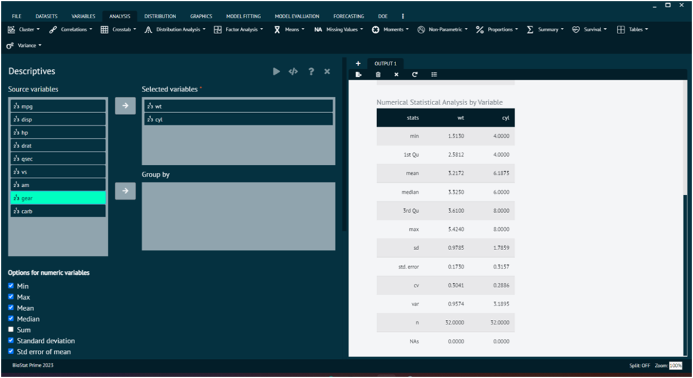
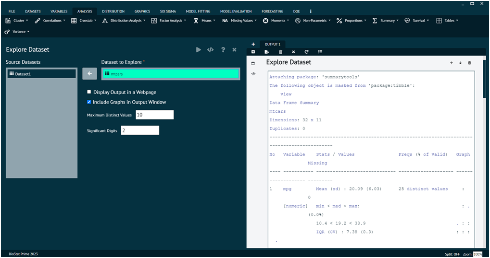
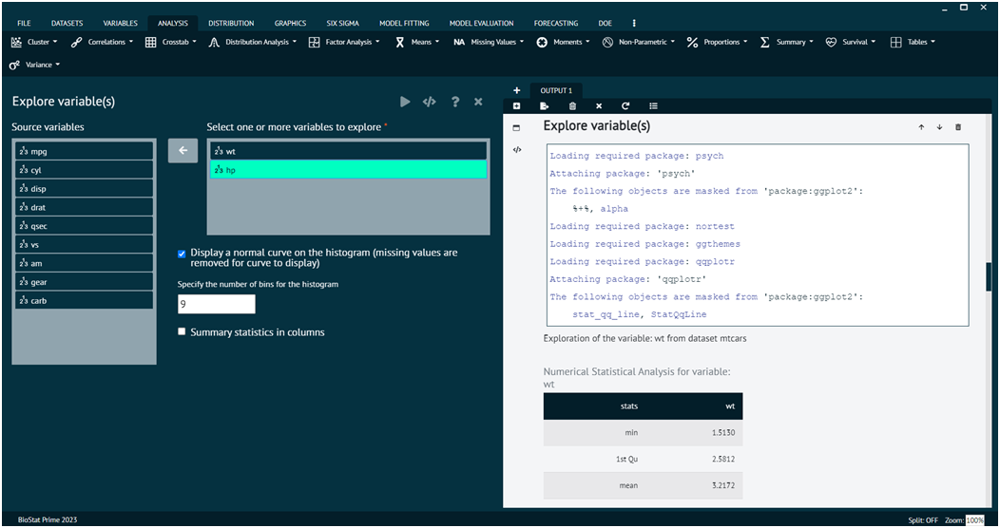
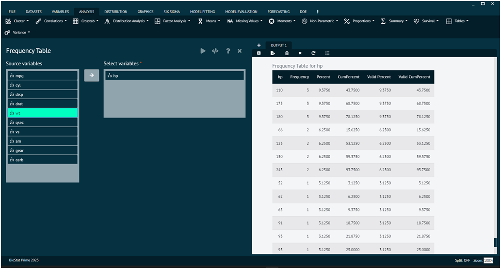

# Summary

## Descriptive Statistics

Descriptive statistics are used to summarize and describe a dataset, providing a clear and concise overview of its main characteristics. There are several types of descriptive statistics commonly used, includingMeasures of central tendency are statistical measures that describe the centre or typical value of a dataset. They provide insight into where the "average" or "middle" of the data lies.

To analyse it in BioStat Prime user must follow the steps as given.

Steps
: __Load the dataset -> Click on the analysis tab in main menu -> Select summary.__

The summary tab contains an option namely descriptive that contains all the descriptive statistic analysis techniques. Once the descriptive techniques are chosen and variables are targeted then, user needs to execute the dialog to see the analysis in output window.

{ width="700" }{ border-effect="rounded" }

In Descriptive function of summary tab, user can opt for options like MIN, MAX, MEAN, MEDIAN, SUM, STANDARD DEVIATION, STD ERROR MEAN as per the requirement.

Furthermore, other functions can also be applied on the dataset like explore dataset, explore variables, frequencies.

>Outputs the following descriptive statistics:
min, max, mean, median, sum, sd, stderror, iqr, Quantiles. If Quantiles is selected, you can specify the comma separated quantiles needed.

>In addition to these, the user can pass, a list of comma separated statistical function names for example var.
>
{style="note"}

>Arguments

datasetColumnObjects
: selected scale variables (say Dataset$var1, Dataset$var2)

groupByColumnObjects
: one or more factor variables to group by (say Dataset$var3, Dataset$var4)

statFunctionList
: List of functions. The ones set to TRUE will be executed. (say min=TRUE, sd=TRUE)

quantilesProbs
: Probabilities of the quantiles

additionalStats
: Addition statistical function that user can pass (say var)

datasetName
: Name of the dataset from which datasetColumnObjects and groupByColumnObjects are chosen

long_table
: Long table option is introduced to accommodate analysis done on a large number of variables. Choosing the long format controls the width of the output table making it easy to view results withing having to scroll right on the output window.

## Explore Dataset

This section of summary tab gives user a chance to explore the dataset. The picture below shows the way user can opt for required dataset and explore it.

This creates a table describing a dataset. Descriptions include the `dataset name`, `number of observations`, `number of variables`, `number of duplicate records`, `variable names`, `variable classes`, `variable summary statistics`, and `graphs`. 

>This tool is meant more for data exploration and cleaning purposes, rather than data analysis purposes. 
>
{style="note"}

>A text version of the table is displayed by default, but a pretty html version can optionally be displayed in the default web browser.
>
{style="note"}

{ width="700" }{ border-effect="rounded" }

>Arguments

Dataset to Explore
: Dataset that you want to describe

Display Output in a Webpage
: Check if you want to display a pretty version of the table in the default web browser. This version will have graphs included.

Include Graphs in Output Window
: Check if you want to include text versions of the graphs in the BioStat output window

Maximum Distinct Values
: The maximum number of values to display frequencies for. If a variable has more distinct values than this number, the remaining frequencies will be reported as a whole category, along with the number of additional distinct values. For character variables, the most frequent values are displayed, so this also controls how many to show in that case. The default is 10.

## Explore Variables

This section of summary tab gives user a chance to explore the variables of loaded dataset. The picture below shows the way user can choose required variables and execute the dialog to explore it.

Outputs the following descriptive statistics and plots: `min`, `max`, `mean`, `median`, `modes`, `sum`, `sd`, `cv (coefficient of variance)`, `var`, `stderror`, `skew`, `kurtosi`, `mad`, `iqr`, and `quartiles`.

>In addition, 95% confidence interval for mean and sd are computed. 
>
{style="note"}

>Histogram and QQ plots are displyed.
>
{style="note"}

{ width="700" }{ border-effect="rounded" }

## Frequency

This section of summary tab gives user a chance to evaluate the frequencies of different variables of loaded dataset. The picture below shows the way user can choose required variables and execute the dialog to evaluate the frequency of selected variable.

Generates the frequencies for every unique value in one or more variables or column names selected.

{ width="700" }{ border-effect="rounded" }
