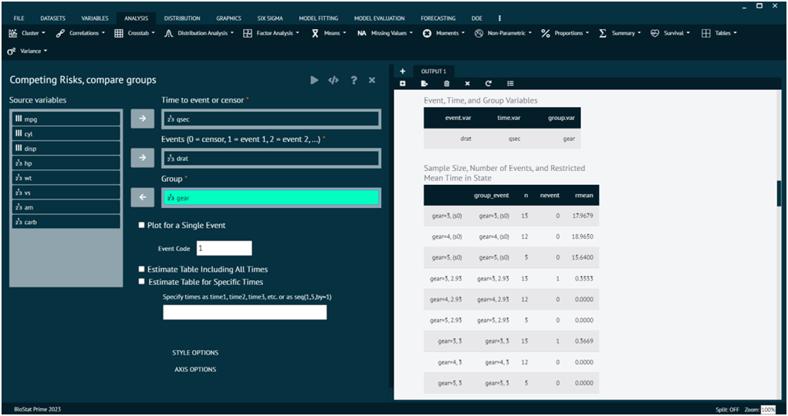
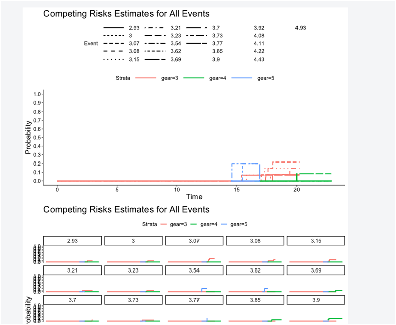
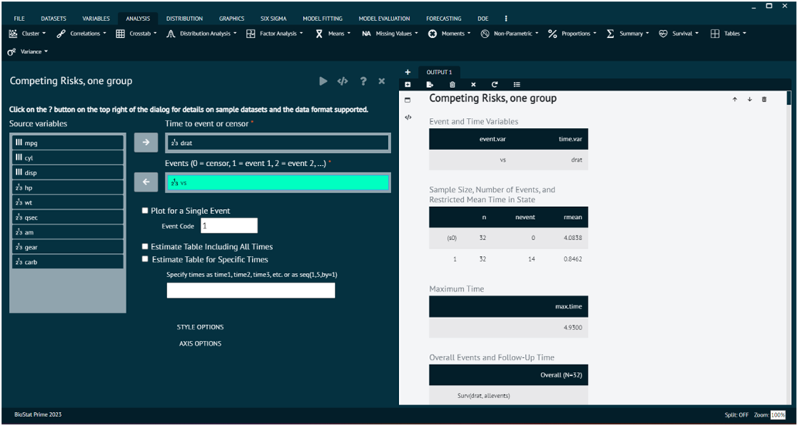
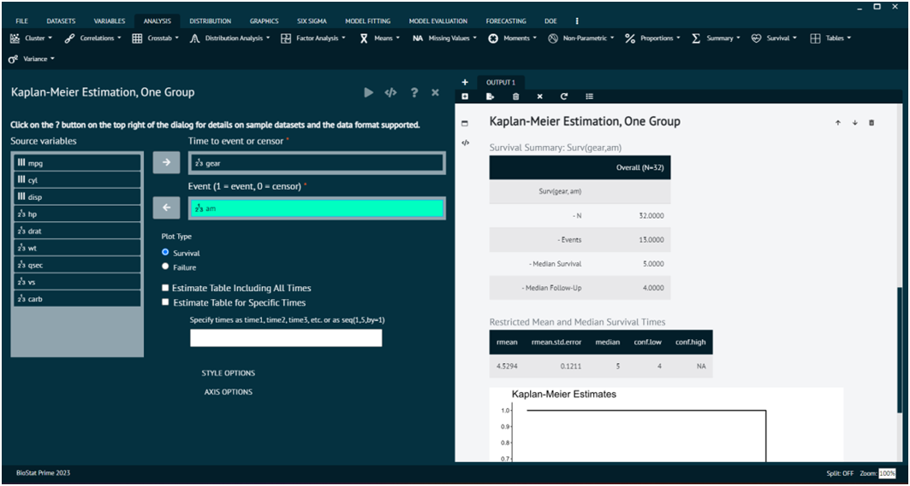

# Survival

In statistics, "survival" refers to the analysis of time until an event of interest occurs. The primary goal of survival analysis is to estimate the time until an event happens and to understand the factors that may influence the time to event. Survival analysis is particularly relevant when dealing with time-to-event data, and it provides a powerful tool for studying and modeling the timing of various events of interest in different fields. It allows researchers to make predictions about the probability of events occurring over time and to compare survival experiences between different groups.

### Competing Risks, Compare groups

In survival analysis, when dealing with multiple events or outcomes that are considered as competing risks, one needs to account for the fact that an individual or subject may experience one type of event, preventing the occurrence of another. The concept of competing risks arises when there are multiple possible failure events, and one is interested in understanding the probabilities and risks associated with each event.

To analyse it in BioStat Prime user must follow the steps as given.

Steps
: __Load the dataset -> Click on the analysis tab in main menu -> Select survival -> The survival tab leads to Competing Risks, Compare groups -> In the dialog select the variable and options according to the requirement -> Execute the dialog.__

{ width="700" }{ border-effect="rounded" }

Competing Risks Estimate for all events in the output window.

{ width="700" }{ border-effect="rounded" }

### Competing Risks, One group

When dealing with competing risks in a single group, one is interested in understanding the probabilities and risks associated with different types of events that may occur, but one does not have a distinct comparison group. The analysis will focus on estimating and comparing the cumulative incidence functions for the competing events within the same group.

To analyse it in BioStat Prime user must follow the steps as given.

Steps
: __Load the dataset -> Click on the analysis tab in main menu -> Select survival -> The survival tab leads to Competing Risks, one  group -> In the dialog select the variable and options according to the requirement -> Execute the dialog.__

{ width="700" }{ border-effect="rounded" }

### Kaplan-Meier Estimation, compare groups

### Kaplan-Meier Estimation, One group

Kaplan-Meier estimation is a non-parametric method used in survival analysis to estimate the probability of an event (e.g., survival) occurring at a given time. It is often applied when studying the time until an event of interest, such as the failure of a system, the onset of a disease, or the occurrence of a specific event in a study.

To analyse it in BioStat Prime user must follow the steps as given.

Steps
: __Load the dataset -> Click on the analysis tab in main menu -> Select survival -> The survival tab leads to Kaplan-Meier Estimation, one  group -> In the dialog select the variable and options according to the requirement -> Execute the dialog.__

{ width="700" }{ border-effect="rounded" }

Kaplan-Meier Estimates in the output.

{ width="700" }{ border-effect="rounded" }
