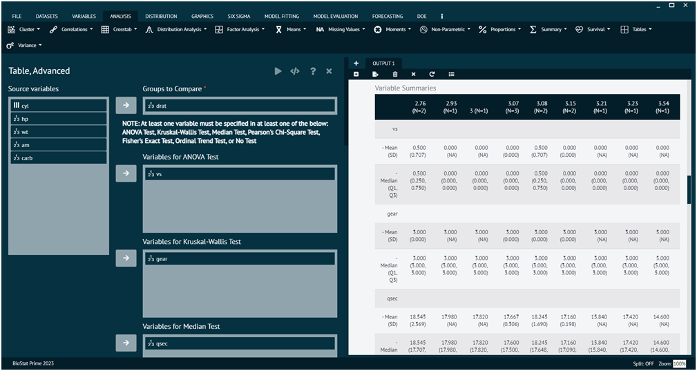
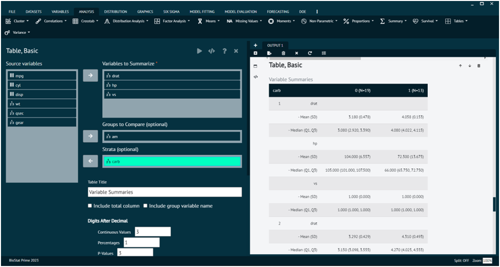

# Tables

Tables in statistics are a common way to organize and present data for easy interpretation. Different types of tables are used depending on the nature of the data and the specific goals of the analysis.

### Table, Advanced

The examples for this category are ANOVA Table, Regression Coefficients Table, Survival Analysis Table etc.

{ width="700" }{ border-effect="rounded" }

### Table, Basic

The examples for this category are Frequency Distribution Table, Summary Statistics Table, Contingency Table (Cross-tabulation) etc.

{ width="700" }{ border-effect="rounded" }
