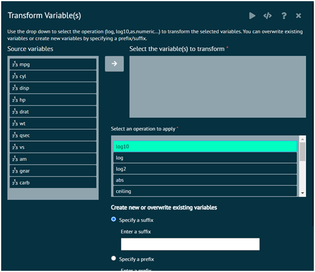

# Transform Variable(s) 
Use the drop down to select the operation (log, log10,as.numeric...) to transform the selected variables. User can overwrite existing variables or create new variables by specifying a prefix/suffix.

{ width="700" }{ border-effect="rounded" }

{type="full"}
Arguments
:
1. var: The variable to be transformed
2. Dataset: The dataset that contains the variable var