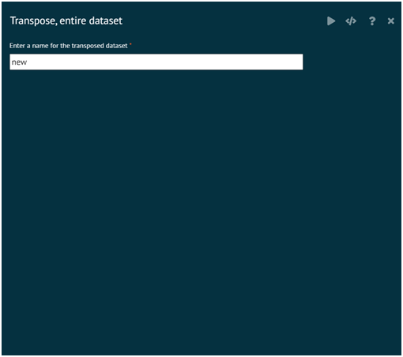
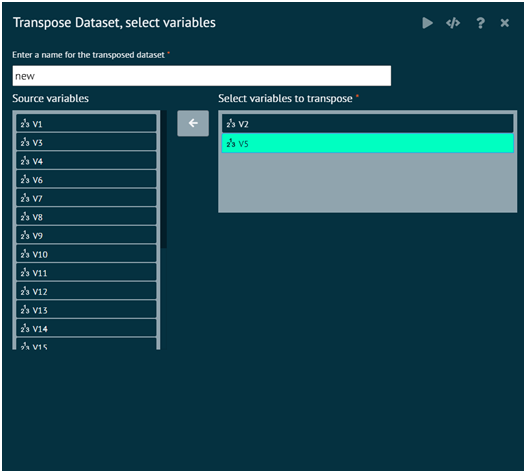

# Transpose

### Transpose entire dataset
Invokes the transpose function in the base package that transposes the dataset. User have to specify the name of the dataset that stores the transposed dataset. The new transposed dataset is displayed in the grid.

{ width="700" }{ border-effect="rounded" }

### Transpose dataset, select variables
Invokes the transpose function in the base package that transposes the variables selected and stores the results in the new dataset. User have to specify the name of the dataset that stores the transposed dataset. The new transposed dataset is displayed in the grid.

{ width="700" }{ border-effect="rounded" }