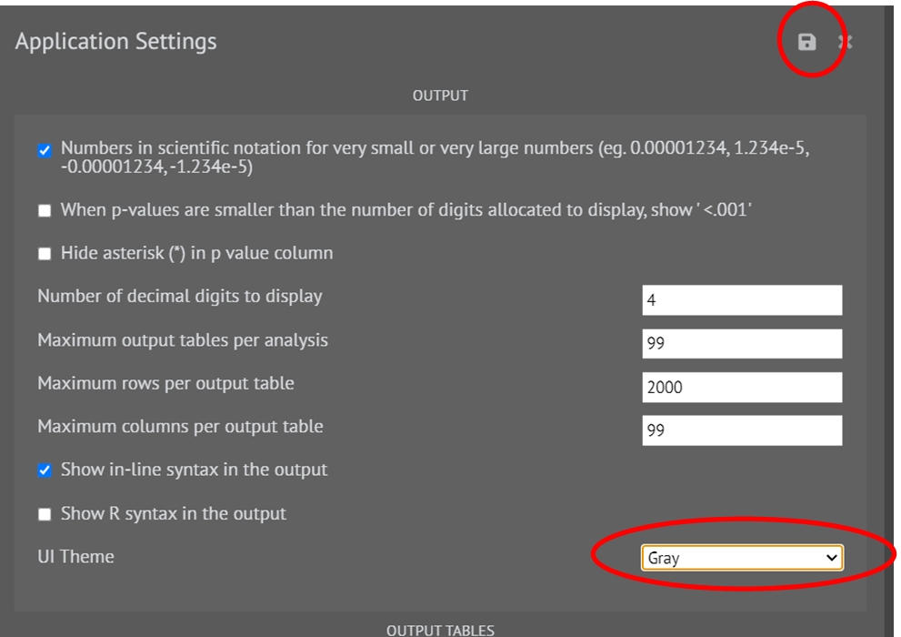

# Settings Menu

This is the last section of main menu of the software that comprises 5 sub menus. It is represented by 3 dots. Functionality of each menu is discussed below.

{ width="700" }{ border-effect="rounded" }

## Settings

This section of the software provides the user with ability to modify the application settings according to user’s personal requirements. This section has five subsections namely.

__OUTPUT:__  Used to modify no. of rows and columns in output, no. of tables in output and other settings related to UI of the software.

{ width="700" }{ border-effect="rounded" }

The icon at top right corner is used to save the changes.

__OUTPUT TABLES:__ Used to modify settings related to theme, font, LaTeX of the tables that appear in the output.

{ width="700" }{ border-effect="rounded" }

__MISC:__ This section of the settings enables the user to modify miscellaneous settings of the application.

{ width="700" }{ border-effect="rounded" }

__R-LOCALE:__ Used for language setting of R engine.

{ width="700" }{ border-effect="rounded" }

__DATABASE:__ Enables the user to choose the location for database.

{ width="700" }{ border-effect="rounded" }

## Themes

This section of the software provides the user with ability to customize the look of the output labels.

{ width="700" }{ border-effect="rounded" }

## Help

This section of the software provides the user with the documentation  regarding
1.	Functions of R language used in the software. User just needs to enter the name of the function.
2.	Packages of R language used in the software. User just needs to enter the name of the package.
3.	Help about the R version used in the software. User just needs to press the execute button.

{ width="700" }{ border-effect="rounded" }

## Diagnostics

This section of the software provides the user the information regarding.
1.	Details about selected package. The user needs to select a package and execute the dialog. The details about the package will appear in the output window as shown in the picture.

{ width="700" }{ border-effect="rounded" }

2.	List of installed packages. The user needs to select a library path. Packages installed to the selected library path will be displayed and then execute the dialog. The details about the package will appear in the output window as shown in the picture.

{ width="700" }{ border-effect="rounded" }

## Install R package(s)

This section of the software aids the user to install R packages. Here are a few guidelines that user should follow while installation.

1.	Case matters in R package names. User can use (,) as a separator to install several package names.
2.	User must have write access to the path selected where the R package will get installed.
3.	The user needs to Enter the URL of the CRAN repository.

{ width="700" }{ border-effect="rounded" }