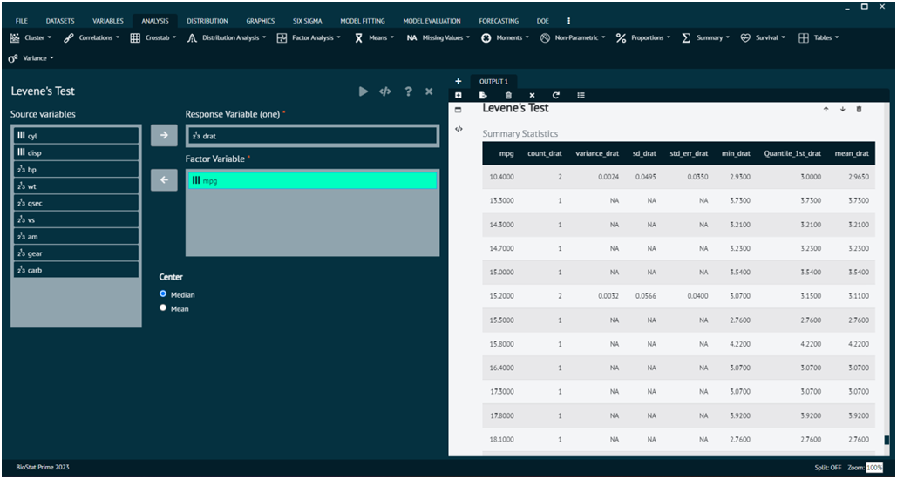
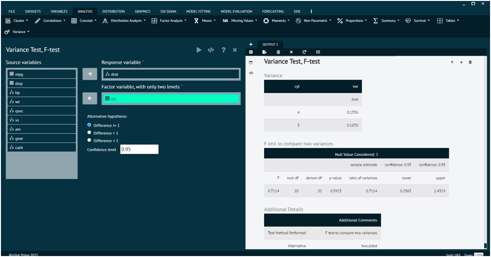

# Variance

In statistics, variance is a measure of the dispersion or spread of a set of values. It quantifies how much individual data points in a dataset differ from the mean (average) of the dataset. A low variance indicates that the values tend to be close to the mean, while a high variance indicates that the values are more spread out.

### Bartlett’s Test

Bartlett's test is a statistical test used to assess whether the variances of two or more groups are equal. It is commonly employed when conducting analysis of variance (ANOVA) to determine whether there are significant differences in the variances between groups. The test is sensitive to departures from normality.

To analyse it in BioStat Prime user must follow the steps as given.

__Load the dataset -> Click on the analysis tab in main menu -> Select variance -> The variance tab leads to Bartlett’s test -> In the dialog select the variable and options according to the requirement -> Execute the dialog.__

{ width="700" }{ border-effect="rounded" }

### Levene’s Test

Levene's test is a statistical test used to assess whether the variances of two or more groups are equal. Like Bartlett's test, Levene's test is commonly used in analysis of variance (ANOVA) to evaluate the assumption of homogeneity of variances (homoscedasticity). It is less sensitive to departures from normality compared to Bartlett's test and is often considered a robust alternative.

To analyse it in BioStat Prime user must follow the steps as given.

__Load the dataset -> Click on the analysis tab in main menu -> Select variance -> The variance tab leads to Levene’s test In the dialog select the variable and options according to the requirement -> Execute the dialog.__

{ width="700" }{ border-effect="rounded" }

### Variance Test, F-test

The F-test is a statistical test used to compare variances between two or more groups. It is often employed in the context of analysis of variance (ANOVA) to assess whether the variances of different groups are equal. The F-test follows an F-distribution, and the null hypothesis is that the variances are equal across groups.

{ width="700" }{ border-effect="rounded" }

