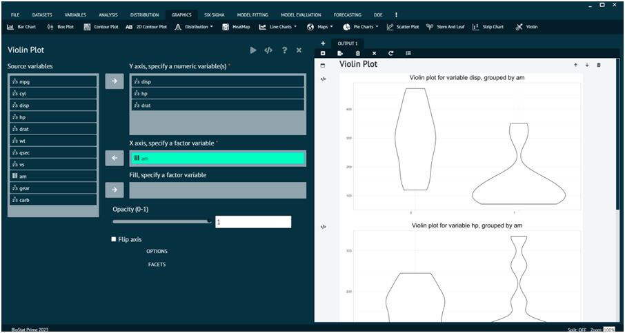

# Violin

For representing any dataset in terms of Violin.

__Load the dataset that needs to be visualized -> Go to Graphics -> Violin -> Put in the values for variables -> Execute the dialog.__

{ width="700" }{ border-effect="rounded" }
