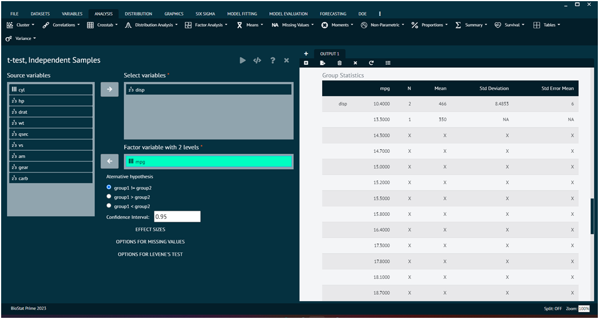

# t-test, Independent

An independent samples t-test is a statistical test used to compare the means of two independent groups to determine if there is a significant difference between them. It's commonly employed when you have two separate groups of observations, and you want to assess whether the means of these groups are statistically different from each other.

To analyse it in BioStat Prime user must follow the steps as given.

__Load the dataset -> Click on the analysis tab in main menu -> Select means -> The means tab leads to the t-test, Independent analysis technique in the dialog -> In the dialog select the variable and options according to the requirement -> Execute the dialog.__

{ width="700" }{ border-effect="rounded" }