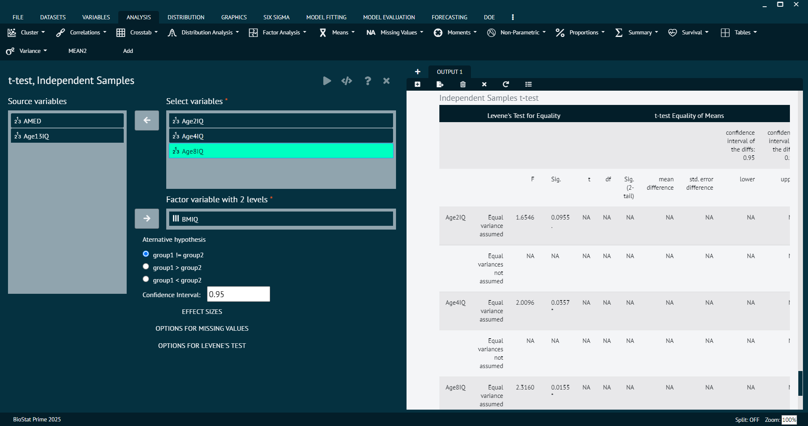

# t-test, Independent

An independent samples t-test is a statistical test used to compare the means of two independent groups to determine if there is a significant difference between them. It's commonly employed when user has two separate groups of observations, and user wants to assess whether the means of these groups are statistically different from each other.

Performs a one sample t-tests against the two groups formed by a factor variable (with two levels). Displays results for equal variances __TRUE__ and __FALSE__. For equal variances the pooled variance is used otherwise the Welch (or Satterthwaite) approximation to the degrees of freedom is used. Internally calls t.test in the stats package for every selected variable.

To analyse it in BioStat Prime user must follow the steps as given.

Steps
: __Load the dataset -> Click on the analysis tab in main menu -> Select means -> The means tab leads to the t-test, Independent analysis technique in the dialog -> In the dialog select the variable and options according to the requirement -> Execute the dialog.__

{ width="700" }{ border-effect="rounded" }

>Arguments

varNamesOrVarGlobalIndices
: selected scale variables (say var1, var2)

group
: a factor variable with two levels (say var3)

conf.level
: a numeric value (say 0.95) .

missing
: missing values are handled on a per variable basis (missing =0) or list wise across all variables (missing=1).

datasetNameOrDatasetGlobalIndex
: Name of the dataset (say Dataset) from which var1, var2 and var3 are selected.

alternative
: a character string specifying the alternative hypothesis, must be one of "two.sided" (default), "greater" or "less". You can specify just the initial letter.