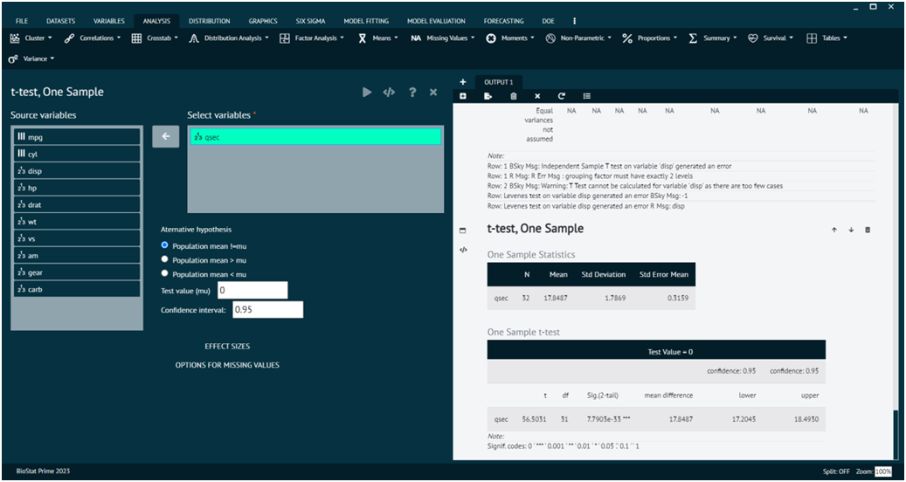

# t-test, One Sample

A one-sample t-test is a statistical test used to determine if the mean of a single sample is significantly different from a known or hypothesized population mean. It's commonly used when you have a sample of data and want to assess whether the sample mean is consistent with a specific population value.

To analyse it in BioStat Prime user must follow the steps as given.

__Load the dataset -> Click on the analysis tab in main menu -> Select means -> The means tab leads to the t-test, one sample analysis technique in the dialog -> In the dialog select the variable and options according to the requirement -> Execute the dialog.__

{ width="700" }{ border-effect="rounded" }