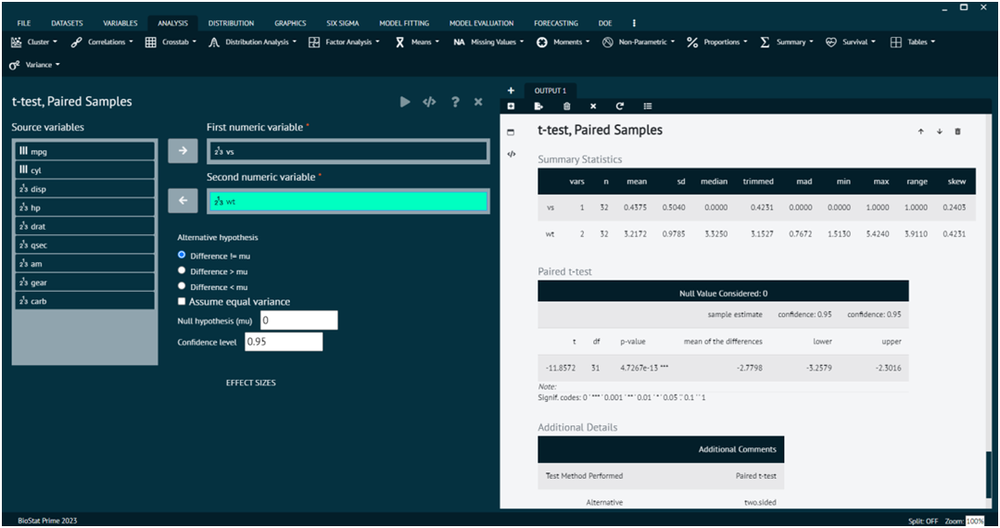

# t-test, Paired Samples

A paired samples t-test (also known as a dependent samples t-test or a matched-pairs t-test) is a statistical test used to determine if there is a significant difference between the means of two related groups. 

>The key characteristic of this test is that it is applied to paired observations, where each observation in one group is directly related to an observation in the other group.

Performs one sample t-tests on selected variables. Optionally computes effect size indices for standardized differences: Cohen's d and Hedges' g (This function returns the population estimate.)

To analyse it in BioStat Prime user must follow the steps as given.

Steps
: __Load the dataset -> Click on the analysis tab in main menu -> Select means ->The means tab leads to the t-test, paired samples analysis technique in the dialog -> In the dialog select the variable and options according to the requirement -> Execute the dialog.__

{ width="700" }{ border-effect="rounded" }
